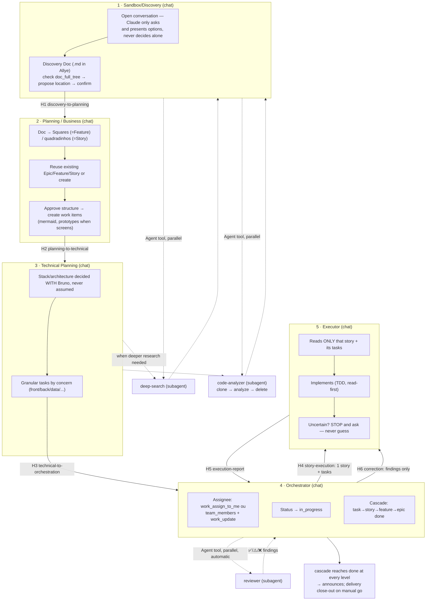

# Allye Guided Delivery Workflow (Sandbox → Delivery)

**Status:** Approved v2.1 — 2026-07-12 (all open questions resolved, see §10)
**Author:** Bruno Fernandes (via brainstorming session with Claude)
**Date:** 2026-07-12 (v2, same day — revised after brainstorm round 2 + market/skill research)

## 1. Problem

The current plugin has a solid Planning → Technical Planning → Development → Review → Delivery skill chain, but three things don't match how Bruno actually wants to work:

1. **No entry point for pure ideation.** There's no phase for "I have a vague goal and want to think out loud, research, and land on a direction" before committing to work items. Product Planning already assumes you're ready to define an Epic/Feature/Story hierarchy.
2. **No cross-chat handover mechanism on Claude Code.** Bruno's working style is one fresh, lean-context chat per phase, bridged by a copy-pasted "handover" text he reads and approves. OpenCode's `allye-plan.ts` already implements exactly this pattern (`PLAN_HANDOFF_FLOW`) — but only for Plan → Build; Build, Review, and Deliver generate no handoff at all, and Claude Code has nothing like it.
3. **No delivery orchestration.** Nothing today manages assignee, drives an Executor/Reviewer loop, or cascades status up the hierarchy (task → story → feature → epic) as work completes. `allye-technical-delivery` does a one-shot version of the cascade, but only at the very end of a single story.

Two latent repo problems surfaced while researching this design and get fixed as part of it:

- **Interactive roles shipped as non-interactive agents.** In Claude Code, `agents/allye-planner.md`, `agents/allye-builder.md`, and `agents/allye-deliverer.md` are dispatched via the `Agent` tool, which runs to completion without being able to pause and ask the human a question — yet the skills these agents load explicitly require asking the user mid-task. This has never matched. `agents/allye-reviewer.md` is the exception — review doesn't need mid-task human input, so subagent dispatch is correct there.
- **Dead, drifting legacy skill copies.** `skills/workflows/`, `skills/methodology/`, `skills/reference/`, and `skills/bootstrap/` are read by nothing (only a hook fallback touches `bootstrap/`) and have already diverged from the canonical `skills/allye-*/SKILL.md` files — e.g. the canonical technical-planning skill has a `memory_graph` section its legacy twin lacks.

## 2. Goals

- A fluid but directed flow: at every fork, Claude asks and presents options — it never picks a direction unilaterally.
- Freedom to research (deep web search + deep code analysis of public repos) available wherever it's useful — Sandbox first, but Technical Planning too.
- A **Handover catalog** connecting every phase transition: each transition has its own named type, objective, and template — refined in one central place, since the handover is "o ouro da parada."
- Delivery is actively orchestrated: assignee kept correct, status cascades automatically, review runs in parallel, corrections loop back to the same executor.
- **Adapt, don't reinvent:** where the community already proved a discipline (brainstorming gates, TDD, plan-writing, review rigor), adapt that content into the Allye context with credit instead of writing a weaker version from scratch.

## 3. Non-goals

- Not rebuilding `allye-mcp` — the tool surface already supports everything this design needs (confirmed by reading the source, see §8).
- Not automating away the human's copy-paste between chats. That manual step is the point — it's what keeps each chat's context lean and lets Bruno approve the transition.
- Not taking runtime dependencies on other plugins (superpowers etc.). Reuse is by adaptation-with-credit, never by requiring another install.
- Not a rewrite of Product/Technical Planning's substance — both already have the right bones (discussion phase, gray areas, locked vs. agent-discretion decisions). This design extends them.

## 4. Roles and mechanism

Six phases plus three reusable subagents. The hard architectural rule: **a dispatched subagent must never need mid-task human input** — on every platform (Claude Code's `Agent` tool, OpenCode's `task` tool, Cursor), dispatched agents run to completion without being able to pause and ask. Anything that questions Bruno runs as a skill in the main conversation thread.

### 4.1 Phases (skills, main thread)

| # | Phase | Skill (new name) | Existing base | Delta |
|---|-------|------------------|----------------|-------|
| 1 | **Sandbox / Discovery** | `sandbox` | none | new: open-ended questioning, optional parallel research via the two research agents, Discovery Doc |
| 2 | **Planning** (business) | `product-planning` | `allye-product-planning` | + squares↔Feature/Story framing, reuse-or-create check, mermaid, prototypes, handover-out |
| 3 | **Technical Planning** | `technical-planning` | `allye-technical-planning` | strengthen "never assume," mandatory stack/architecture gray area, granularity-by-concern, may dispatch research agents, handover-out |
| 4 | **Orchestrator** | `orchestrator` | cascade fragment of `allye-technical-delivery` | new: assignee management, dispatches Executor via handover + Reviewer via `Agent` tool, correction loop, continuous status cascade |
| 5 | **Executor** | `execution` | `allye-technical-development` | scoped to exactly one story, handover-out, strengthened ask-don't-assume |
| 6 | **Delivery close-out** | `delivery` | `allye-technical-delivery` | content unchanged; **manual** — Orchestrator announces epic completion and waits for Bruno's go (see §6.6) |

### 4.2 Reusable subagents (`agents/`, dispatched via `Agent` tool)

| Agent | File | Job | Dispatched from |
|---|---|---|---|
| **Reviewer** | `agents/reviewer.md` | Code review with decision context; ✅/⚠️/❌ per task | Orchestrator (parallel, automatic) |
| **Deep Search** | `agents/deep-search.md` | Deep, multi-source web research on a stated objective; returns synthesized findings | Sandbox, Technical Planning |
| **Code Analyzer** | `agents/code-analyzer.md` | `git clone --depth 1` a public repo into the session scratchpad → analyze EVERYTHING against the stated objective → return a complete summary → `rm -rf` the clone unconditionally (including on failure) | Sandbox, Technical Planning |

All three are bounded, question-free tasks — that's what makes them dispatch-safe. Each agent's frontmatter preloads its matching skill content via the official `skills:` mechanism instead of duplicating workflow text (this kills the current `agents/*.md` ↔ skill duplication).



## 5. The Handover Catalog (foundational — new shared skill)

New skill: `skills/handover-protocol/`. **Each transition is its own named handover type with its own objective and template** — not one generic form. Only the detection marker is shared. Structure follows the market's progressive-disclosure convention: `SKILL.md` holds the marker spec + the catalog table; `references/<type>.md` holds each full template — one file per type, all in one skill, so refining a handover always happens in the same place.

### 5.1 Shared marker (the only common part)

A handover is chat text only — never saved as a memory or file (the Allye doc/work items it references are the durable record; the handover is a disposable transport vehicle, copy-pasted by hand in both directions).

```markdown
## 🔄 Allye Handover — {type}
**Skill to load:** {skill-slug}
...type-specific body...
---
If anything is unclear, STOP and ask — don't proceed on a guess.
```

### 5.2 The six types

| Type | Transition | Specific objective | Distinctive payload |
|---|---|---|---|
| `discovery-to-planning` | Sandbox → Planning | Turn the approved direction into a deliverable structure | Discovery Doc ref; paths explored **and rejected** (with why); research findings; prototypes if any |
| `planning-to-technical` | Planning → Tech Planning | Technically detail the approved squares | Epic/feature/story keys (created AND reused, distinguished); locked business decisions; prototypes |
| `technical-to-orchestration` | Tech Planning → Orchestrator | Drive delivery of the planned feature | Full reading list: doc + hierarchy + tasks + waves; locked architecture decisions |
| `story-execution` | Orchestrator → Executor | Implement exactly one story | ONE story + its tasks, nothing more; applicable code standards; TDD expectation |
| `execution-report` | Executor → Orchestrator | Return the implementation result | Files changed; tests added; status per acceptance criterion; new decisions; open questions |
| `correction` | Orchestrator → Executor | Fix specific review findings | Only the reviewer's ❌ findings + affected tasks + story ref — **doesn't** re-brief the whole story |

(Reviewer never receives a handover — it's invoked via the `Agent` tool with a constructed prompt, not by paste.)

### 5.3 Auto-detection

`using-allye`'s bootstrap gets a new step, checked before the existing phase-detection table: if the user's first message contains a `## 🔄 Allye Handover` block, parse the `{type}` and `Skill to load`, and load that skill immediately — skip heuristic phase-guessing (explicit marker over inference, Bruno's choice). Detection lives in every bootstrap surface: Claude Code (`skills/using-allye/SKILL.md` via `hooks/session-start.sh`) and the OpenCode adapter — same marker format everywhere, so a handover generated on one tool works pasted into another.

## 6. Phase designs

### 6.1 Sandbox / Discovery — new skill (`skills/sandbox/`)

- **Trigger** (new row in `using-allye`'s routing table): user wants to explore ideas, hasn't committed to a direction, wants to think out loud or research before defining scope.
- **Core rule**: Claude never unilaterally decides. It asks — one focused round at a time — and when it has a view, presents options with a recommendation. Adapts superpowers `brainstorming`'s HARD-GATE (no implementation until direction approved) and its anti-rationalization table, plus Trail of Bits' `ask-questions-if-underspecified` rubric for when to ask vs. proceed (see §7).
- **Research sub-step** (optional, user-triggered, parallel is fine): dispatch `deep-search` and/or `code-analyzer` (§4.2). Code-analyzer adapts humanlayer's `research_codebase` constraint: *document what exists — no suggestions, no critique* — so research findings don't contaminate the direction discussion with premature solutioning.
- **Exit**: synthesize into a Discovery Doc. Before creating: `doc_full_tree` → propose a parent location → get Bruno's explicit confirmation of placement. Create via `doc_create`. Emit **H1 `discovery-to-planning`**.

### 6.2 Planning / Business — extends `product-planning` (renamed)

- **Step 0**: if arrived via H1, read the referenced Discovery Doc first.
- **Vocabulary**: a "square" is a Feature-sized deliverable (a puzzle piece); a "quadradinho" is a Story inside it. Working vocabulary — still resolves to the real Epic → Feature → Story hierarchy.
- **Reuse-or-create**: before proposing new items, search (`work_list`, `work_children`) and show explicitly which items are reused vs. created — never silently duplicate.
- **Story quality**: adapt spec-kit's template language — every story independently testable/deliverable, Given/When/Then acceptance scenarios, priority such that P1 alone is a viable increment. BMAD's `create-epics-and-stories` (equal-partner collaboration framing) informs the conversation style.
- **Descriptions**: as detailed as possible; mermaid encouraged (supported in `work_description`).
- **Prototypes**: when a screen is involved, offer to mock it up (Artifact) and carry the ref into the handover.
- **Exit**: after approval and creation, ask whether to emit **H2 `planning-to-technical`**.

### 6.3 Technical Planning — extends `technical-planning` (renamed)

- Keep the Discussion Phase bones; reframe the opening as "never assume — always ask; the user knows the direction, sometimes only after researching further." When deeper research is needed mid-discussion, dispatch `deep-search` / `code-analyzer` — Bruno explicitly wants research available here, not only in Sandbox.
- **Mandatory gray area**: any story implying infrastructure/stack/architecture choices always surfaces that as an explicit discussion point.
- **Granularity by concern**: split tasks along specialty lines (front/back/data/…) when a story spans them; existing Wave mechanic handles ordering (e.g., data modeling before frontend when payload shape is a dependency). Illustrative, not a fixed taxonomy — each story gets scenario-specific granularity, decided with Bruno.
- **Task sizing**: adapt superpowers `writing-plans`' right-sizing rule — smallest unit carrying its own test cycle; split only where a reviewer could reject one task while approving its neighbor.
- **Exit**: emit **H3 `technical-to-orchestration`** with the full reading list.

### 6.4 Orchestrator — new skill (`skills/orchestrator/`)

- **On start**: read H3; load feature/stories/tasks and the doc.
- **Assignee**: resolve current user id from `initialize`. Self → `work_assign_to_me`. Someone else → `team.team_members` for the id, then `work_update(assignee_id)`. Ask when ownership isn't obvious.
- **Status**: claimed items → `in_progress` (`work_status_next`).
- **Dispatch Executor**: emit **H4 `story-execution`** — exactly one story and its tasks, never a whole feature.
- **Dispatch Reviewer**: on receiving **H5 `execution-report`**, call the `Agent` tool with `reviewer`, in parallel, passing story + tasks + files changed. Adapts compound-engineering's `lfg` gate pattern: each pipeline step verifies the previous step's artifact exists before proceeding.
- **React to review** (Reviewer's ✅/⚠️/❌ output):
  - All ✅ → cascade status (§6.6).
  - Any ❌ → emit **H6 `correction`** back to the same Executor with the specific findings; loop. BMAD's `correct-course` (structured change-impact analysis) informs how corrections that ripple beyond one story get handled.
  - **Decided (Bruno):** escalate to Bruno after **3** failed review rounds on the same task, instead of a fourth silent loop.
- Never resolves ambiguity alone (unclear assignee, no active sprint, conflicting status) — asks.

### 6.5 Executor — `execution` (renamed from `allye-technical-development`)

- **Scope**: reads only the one story and its tasks named in H4 — the read-first rule stays, its scope now explicit.
- **Discipline**: TDD per the existing `tdd-workflow` skill (content aligned with superpowers `test-driven-development` where ours is thinner); superpowers `verification-before-completion` adapted as the gate before reporting anything done — evidence (command output) before assertions.
- **Decision checkpoint** becomes load-bearing: "if uncertain which path to take, STOP and ask — never proceed on assumption."
- **Exit**: emit **H5 `execution-report`**.

### 6.6 Status cascade + delivery close-out

The Orchestrator applies the cascade continuously, at every level, as work completes:

1. Task done (criteria met, tests pass, Reviewer ✅) → `work_children` on parent story → all done? → `work_status_done` the story.
2. Story done → check parent feature → all done? → `work_status_done` the feature.
3. Feature done → check parent epic → all done? → `work_status_done` the epic.

**Decided (Bruno, 2026-07-12)**: epic close-out is **manual**. When an epic's cascade completes, the Orchestrator announces it and asks whether to run the `delivery` skill now (same chat) or later (fresh chat, routed by `using-allye`) — it never auto-runs.

## 7. Adaptation sources (reuse policy: adapt with credit, no runtime dependency)

Verified 2026-07-12 (stars via GitHub API; SKILL.md content actually read, not judged by README). Every source below is MIT/Apache except Trail of Bits — see caveat.

| Source | Stars | License | What we adapt | Into |
|---|---|---|---|---|
| obra/superpowers | 253k | MIT | `brainstorming` HARD-GATE + anti-rationalization tables; `writing-plans` task right-sizing; `test-driven-development`; `verification-before-completion`; `subagent-driven-development` two-tier review; `receiving-code-review` (verify feedback, don't performatively agree) | sandbox, technical-planning, execution, orchestrator |
| EveryInc/compound-engineering-plugin | 23k | MIT | Artifact contracts between skills (`artifact_readiness` metadata); `lfg` inter-step gates; `ce-code-review` persona-subagents returning structured JSON; `ce-compound` knowledge capture | handover-protocol, orchestrator, reviewer, memory-protocol |
| humanlayer/humanlayer | 11k | Apache-2.0 | `research_codebase` "document only, no critique" constraint; `create_handoff`/`resume_handoff` context-compaction pattern (closest existing implementation of Bruno's handover concept); skeptical `create_plan` | code-analyzer, handover-protocol, technical-planning |
| bmad-code-org/BMAD-METHOD | 50k | MIT | `create-epics-and-stories` collaboration framing; `correct-course` structured change-impact analysis; step-file just-in-time loading pattern | product-planning, orchestrator, skill structure generally |
| github/spec-kit | 120k | MIT | Story template language (independently testable, Given/When/Then, P1-viable); tasks template with `[P]` parallelizable markers | product-planning, technical-planning |
| trailofbits/skills | 6k | **CC-BY-SA-4.0 ⚠** | `differential-review` risk-first diff review; `spec-to-code-compliance`; `ask-questions-if-underspecified` rubric | reviewer, sandbox — **share-alike license: adapt the ideas, not the prose**, unless we accept CC-BY-SA on the derived skill |
| anthropics/skills | 160k | Apache-2.0 | `skill-creator`'s eval harness + description-trigger optimization — used to QA our own skills, not shipped | meta / plugin QA |

Rule of thumb encoded in the implementation plan: each adapted section carries a one-line credit comment (`<!-- adapted from obra/superpowers brainstorming (MIT) -->`).

## 8. `allye-mcp` capabilities this design relies on (verified against source, not the bundled reference)

| Need | Tool / action | Notes |
|---|---|---|
| Assign to self | `work_items.work_assign_to_me` | unchanged |
| Assign to someone else | `team.team_members` → `work_items.work_update(assignee_id)` | confirmed supported; **not** listed in the bundled quickref today (see §9 cleanup row) |
| Mermaid in descriptions | `work_description`, `doc_content`, memory `content` | all three carry `MERMAID_HINT` |
| Doc placement | `docs.doc_full_tree` → `docs.doc_create(doc_parent_id)` | tree checked before every Discovery Doc creation |
| Current user identity | `initialize` → `profile.user.id` | resolves self vs. other assignee |
| Status cascade | `work_items.work_children`, `work_status_next`, `work_status_done` | no bulk/cascade endpoint — Orchestrator walks the tree explicitly |

## 9. Repository restructure & file-level change map

### 9.1 What the market research says (three findings that drive the shape)

1. **Verbatim skill sharing won; per-tool compilation lost.** BMAD v6.10 abandoned per-IDE builds and now copies SKILL.md folders unchanged; superpowers shares `skills/` verbatim with thin per-harness adapters; spec-kit only rewrites path tokens. Our `generate-prompts.ts` (baking skills into TypeScript for OpenCode) is the retired pattern — superpowers' `.opencode/plugins/*.js` proves a runtime adapter that reads `skills/` directly works.
2. **Prefix only where no namespace protects you.** Claude Code namespaces plugin skills as `allye:<skill>` automatically — `allye-product-planning` surfaces as the stuttering `/allye:allye-product-planning`. BMAD prefixes because its skills land in shared un-namespaced dirs; that's not our Claude Code situation. API slugs are decoupled from dir names in every code path, so server-side slugs can stay `allye-*` while dirs go bare.
3. **Progressive disclosure inside the skill folder** (lean SKILL.md + `references/` + colocated templates) is the convention across BMAD, superpowers, and the official docs — and is exactly the shape the handover catalog needs.

### 9.2 Target structure

```
allye-plugin/
├── .claude-plugin/{plugin.json, marketplace.json}
├── skills/
│   ├── using-allye/              # bootstrap: handover auto-detection + routing (incl. sandbox row)
│   ├── handover-protocol/        # SKILL.md (marker + catalog) + references/{6 types}.md
│   ├── sandbox/                  # NEW
│   ├── product-planning/         # ← allye-product-planning
│   ├── technical-planning/       # ← allye-technical-planning
│   ├── orchestrator/             # NEW
│   ├── execution/                # ← allye-technical-development
│   ├── review/                   # ← allye-technical-review (preloaded by reviewer agent)
│   ├── delivery/                 # ← allye-technical-delivery (triggered by orchestrator)
│   ├── memory-protocol/ tdd-workflow/ board-progression/ tools-quickref/ setup/   # ← prefix dropped
├── agents/
│   ├── reviewer.md               # ← allye-reviewer.md; preloads review skill via `skills:`
│   ├── deep-search.md            # NEW
│   └── code-analyzer.md          # NEW
├── hooks/{hooks.json, session-start.sh}
├── manifests/{codex,cursor,gemini,opencode}/   # thin adapters, slug tables updated
└── packages/allye-opencode/      # runtime skill reader — generate step deleted
```

**Naming principle (decided)**: names must make skills easy for AI agents to identify and route to — role-aligned dir names, plus frontmatter `description` written as explicit trigger conditions ("Use when…"), validated with the skill-creator eval approach from §7.

### 9.3 Change map

| Change | Detail |
|---|---|
| **Delete** | `skills/workflows/`, `skills/methodology/`, `skills/reference/`, `skills/bootstrap/` — dead and drifting; update `hooks/session-start.sh` legacy fallback accordingly |
| **Delete** | `agents/allye-planner.md`, `agents/allye-builder.md`, `agents/allye-deliverer.md` — interactive roles can't be dispatched agents |
| **Rename** | all `skills/allye-*` → bare names per §9.2; `agents/allye-reviewer.md` → `agents/reviewer.md`. API slugs stay `allye-*` (seed/seed-skills.json keeps the mapping); Claude Code invocations become `/allye:product-planning` etc. |
| **New** | `skills/handover-protocol/` (SKILL.md + 6 `references/` templates), `skills/sandbox/`, `skills/orchestrator/`, `agents/deep-search.md`, `agents/code-analyzer.md` |
| **Edit** | `skills/using-allye/` — handover auto-detection step, sandbox routing row, updated skill names |
| **Edit** | `product-planning`, `technical-planning`, `execution` — the deltas in §6.2/6.3/6.5, each with a handover-out step referencing its catalog type |
| **Edit** | `board-progression` — formalize the continuous cascade rule |
| **Rework** | `packages/allye-opencode` — delete `scripts/generate-prompts.ts` + baked `src/prompts/skills-content.ts`; adapter reads `skills/` at runtime (superpowers pattern); agents map to the new role set (orchestrator added, plan/build boundaries redrawn to the phase skills) |
| **Edit** | `manifests/{codex,cursor,gemini}` — slug tables updated to the new names + handover marker detection paragraph |
| **Cleanup** | `tools-quickref` — add `team_members`, `assignee_id`, `subtask`/`spike`/`hotfix` types, `work_category` required-ness (stale today) |

## 10. Decisions resolved in review (Bruno, 2026-07-12)

- **Delivery folding (§6.6)** — epic close-out is **manual**: Orchestrator announces completion and waits for the go; never auto-runs `delivery`.
- **Correction threshold (§6.4)** — escalate after **3** failed review rounds on the same task.
- **Role-aligned renames (§9.2)** — approved (`execution`, `review`, `delivery`); plus the naming principle: skill names and descriptions must be optimized for AI-agent identification (trigger-condition descriptions).
- **Restructure shape (§9)** — superpowers-style structure approved as specified.
